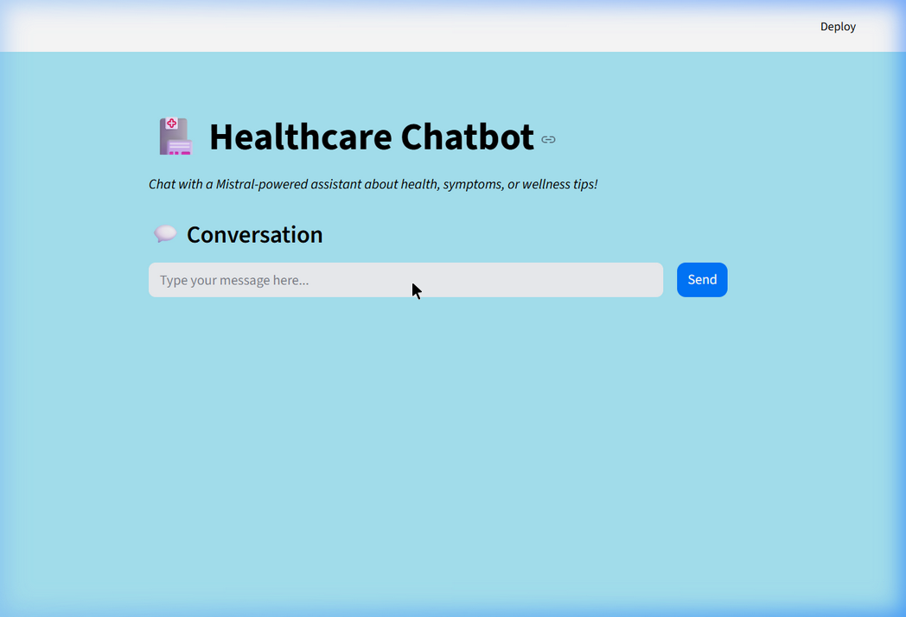
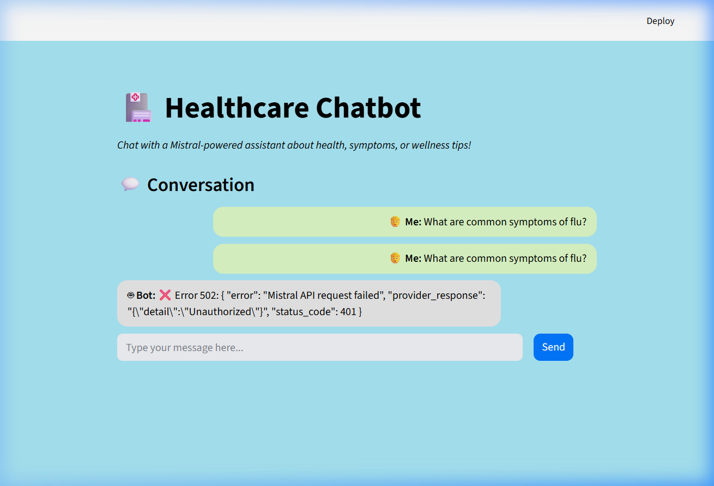

#  Healthcare Chatbot

A Healthcare Chatbot powered by **Mistral AI** with a **Flask** backend and **Streamlit** frontend for health, symptom, and wellness conversations.

---

##  Features

-  Real-time chat interface with styled chat bubbles
-  Powered by Mistral AI (mistral-medium / mistral-small)
-  Flask REST API backend with health check endpoint
-  Custom-styled Streamlit frontend
-  Environment-based configuration for API keys

---

##  Tech Stack

| Layer    | Technology       |
|----------|-----------------|
| Frontend | Streamlit        |
| Backend  | Flask + Flask-CORS |
| AI Model | Mistral AI API   |
| Config   | python-dotenv    |

---

##  Installation

1. **Clone the repository**
   ```bash
   git clone https://github.com/Boovesh985/Healthcare-Chatbot.git
   cd Healthcare-Chatbot
   ```

2. **Install dependencies**
   ```bash
   pip install -r requirements.txt
   ```

3. **Set up environment variables**
   
   Create a `.env` file in the root directory:
   ```env
   MISTRAL_API_KEY=your_mistral_api_key_here
   MISTRAL_MODEL=mistral-small
   FLASK_PORT=8000
   FLASK_DEBUG=true
   ```

---

##  Usage

1. **Start the Flask backend**
   ```bash
   python app.py
   ```

2. **Start the Streamlit frontend** (in a separate terminal)
   ```bash
   streamlit run streamlit_app.py
   ```

3. Open the Streamlit URL (usually `http://localhost:8501`) and start chatting!

---

##  Project Structure

```
Healthcare-Chatbot/
├── app.py              # Flask backend API server
├── streamlit_app.py    # Streamlit frontend UI
├── requirements.txt    # Python dependencies
├── .env                # Environment variables (not tracked)
├── .env.example        # Example environment config
├── .gitignore          # Git ignore rules
├── LICENSE             # MIT License
├── screenshots/        # Application screenshots
│   ├── chatbot_interface.png
│   └── chatbot_conversation.png
└── README.md           # Project documentation
```

---

##  API Endpoints

| Method | Endpoint         | Description              |
|--------|-----------------|--------------------------|
| GET    | `/health`        | Health check             |
| POST   | `/api/generate`  | Generate chat response   |

### Request Body (`/api/generate`)
```json
{
  "prompt": "What are the symptoms of flu?",
  "max_tokens": 512,
  "temperature": 0.7
}
```

## 📸 Screenshots

### Chat Interface


### Chat Conversation


---

##  License

This project is open source and available under the [MIT License](LICENSE).

